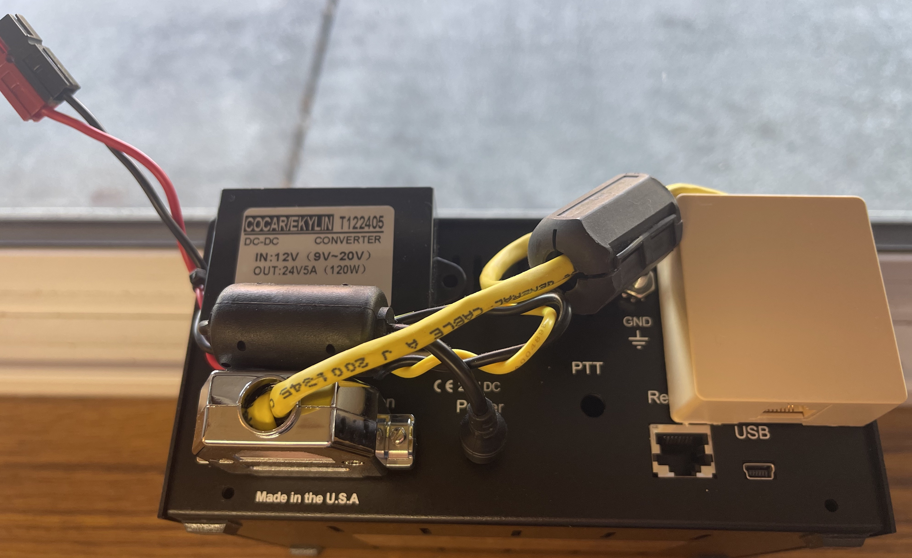
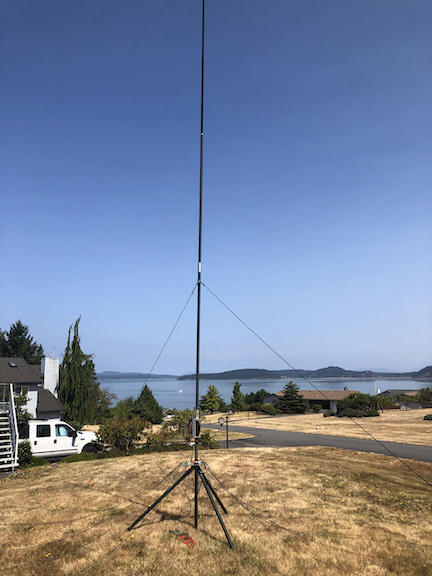
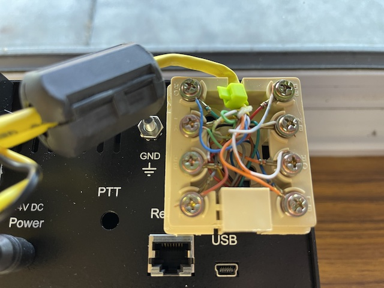
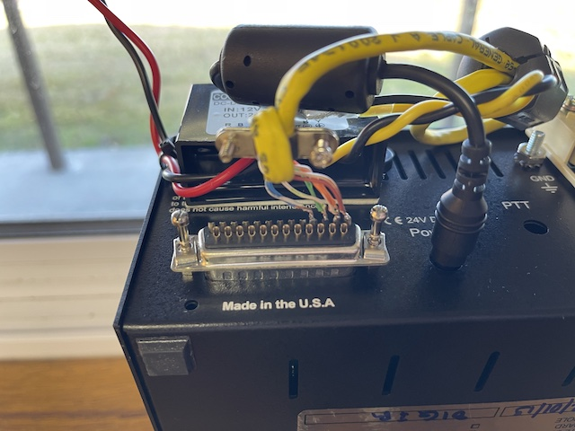
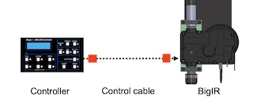

# steppir-mods

## SDA-100 Portable Operations

your looking at the backside of the SDA-100 used in field ops on a big-ir. there is nothing hidden or fancy just a RJ-45 wall box and a buck and a choke some cat5. all wired up logically for a single servo stepp-ir servo such as the big-ir.

I have used this in the field with success for a while now cat-5 is 50' coax 50' battery POTA or otherwise. Big-IR 

### What does the device do?
- The SDA-100 is 24v, the buck allows drive on 12v and the cat5 replaces the Control/Servo

### How is it used?
- attach 12v attach cat5 and operate with (BIG IR in my case single servo)

### How did you build it?

- (2)RJ-45 Wall boxes Cat-5
- (2)Ferrite chokes (looking up exact but likley typical mix)
- Cat-5, I used plenum grade nothing fancy
- (1)DC 12v to 24v Step up Converter Regulator 5A 120w from (amaz,ebay,etc)
  - If noise is a problem, the SDA-100 only needs powered up during tuning

### Operation notes
I am careful to avoid static hits, or hot plugging any wires, practice your setup and take your time :)

## Detailed photos

Doubled up the pairs

- Not shown EHU/Transport/Servo Assembly module (yet, its the same configuration)
- I would run another cat5 (so 4 total RJ-45 wall boxes) for a second EHU ..Untested so far.. urban pending..

A block diagram if needed the red box is the RJ-45 wall box (you need two of them)

## Recognition
Thanks to K5GS for encouraging me to publish, and assistance with documentation.
